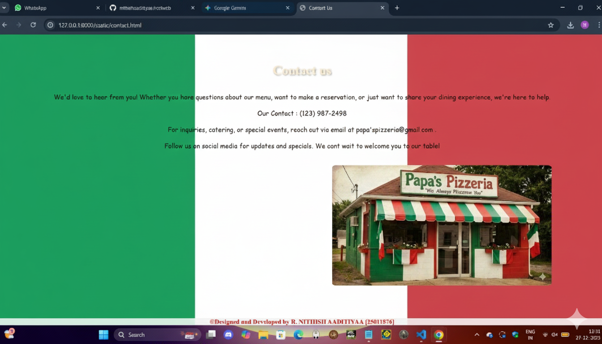

# Ex.06 Restaurant Website
## Date:

## AIM:
To develop a static Restaurant website to display the food items and services provided by them.

## DESIGN STEPS:

### Step 1:
Requirement collection.

### Step 2:
Creating the layout using HTML and CSS.

### Step 3:
Updating the sample content.

### Step 4:
Choose the appropriate style and color scheme.

### Step 5:
Validate the layout in various browsers.

### Step 6:
Validate the HTML code.

### Step 7:
Publish the website in the given URL.

## PROGRAM:
```
home.html

<html>
  <head>
    <title>Papa's Pizzeria</title>
    <link rel="stylesheet" type="text/css" href="home.css">  
  </head>
  <body bgcolor="#f4e2d8" background="pizzeria.jpg">
      <h1 class="site-title">Papa's Pizzeria</h1>
    </div class="header">
      <nav>
        <a href="home.html">Home</a>
        <a href="menu.html">Menu</a>
        <a href="admin.html">Administration</a>
        <a href="contact.html">Contact Us</a>
      </nav>
    </div>
    <div class="container">
      <div class="column">
        <h3>Our New Menu</h3>
        
        <p>Discover our latest dishes crafted with fresh ingredients and bold flavors.</p>
        <a href="#">See our new menu</a>
      </div>
      <div class="column">
        <h3>Book a Table</h3>
        
        <p>Reserve your spot and enjoy a delightful dining experience with us.</p>
        <a href="#">Book your table now</a>
      </div>
      <div class="column">
        <h3>Opening Hours</h3>
        
        <p>We're open at:</p>
        <ul>
          <li>Mon - Fri: 10am to 10pm</li>
          <li>Sat: 10am to 11pm</li>
          <li>Sun: 10am to 11pm</li>
        </ul>
      </div>
    </div>

    <footer>
      &copy;Designed and Developed by <span> R. NITHISH AADITIYAA [25011876]</span>
    </footer>

  </body>
</html>

home.css

* {
  box-sizing: inherit;
}

    html, body {
      height: 100%;
      margin: 0;
      padding: 0;
      font-family: Arial, sans-serif;
      background-repeat: no-repeat;
      background-size: cover;
      background-position: center center;
      background-attachment: fixed;
     
    }

  
    header, footer {
      background-color: #f4f4f4;
      padding: 20px;
      text-align: center;
    }


.header
 {
  display: flex;
  justify-content: space-around; 
  background-color: #333;
  padding: 20px;
  position:relative;
  width: 100%;
  z-index: 1000;

}

nav a {
  color: lime;
  text-decoration: none;
  font-size: 20px;
  padding: 12px 24px;
  background-color: #4CAF50; 
  border-radius: 8px;
  transition: background-color 0.3s ease;
  box-shadow: 0 4px 6px rgba(0,0,0,0.2);
}

nav a:hover {
  background-color: black; 
}


.main {
      flex: 1;
      padding: 20px;
    }

.container {
      display: flex;
      justify-content: space-around;
      gap: 20px;
    }

.column {
      width: 30%;
      background-color: #fafafa;
      padding: 15px;
      border-radius: 8px;
    }

.column img {
      width: 100%;
      height: auto;
      border-radius: 5px;
    }

  
footer {
      font-weight: bold;
      color: red;
      position: fixed;
      left: 0;
  bottom: 0;
  width: 100%;
    background-color: #f4f4f4;
    text-align: center;
     
    }

footer span {
      color: blue;
    }
@import url('https://fonts.googleapis.com/css2?family=Rock+Salt&display=swap');

.site-title {
  font-family: 'Rock Salt', cursive;
  font-size: 60px;
  color: #f02c2c; 
  text-align: center;
  margin-top: 20px;
}

menu.html

<html>
<head>
    <title>Papa's Pizzeria</title>
    <link href="menu.css" rel="stylesheet">
    <link rel="stylesheet" href="menu.css">
        <h1 class="site-title">Papa's Pizzeria</h1>
</head>
<body>
    <section class="menu-section">
        <h1>The Menu</h1>
        <div class="category">
                         <div class="menu-item">
                
                <h3>Bruschetta</h3>
                <p>Grilled bread topped with tomatoes, garlic, and basil. $8.99</p>
            </div>
            <div class="menu-item">
                
                <h3>Quattro Formaggi Pizza</h3>
                <p>A four-cheese blend usually featuring Mozzarella, Gorgonzola, Parmigiano-Reggiano and Fontina . $9.99</p>
            </div>
            <div class="menu-item">
                
                <h3>Prosciutto e Rucola</h3>
                <p>Pizza is topped with fresh arugula and thin slices of salty Prosciutto di Parma.. $9.99</p>
            </div>
            <div class="menu-item">
                
                <h3>Capricciosa Pizza</h3>
                <p>Pizza topped with ham, mushrooms, artichokes, and olives. $9.99</p>
            </div>
            <div class="menu-item">
                
                <h3>Supplí / Arancini</h3>
                <p>Fried rice balls filled with tomato and a heart of mozzarella. $6.49</p>
            </div>
            <div class="menu-item">
                
                <h3>Crocché di Patate</h3>
                <p>Creamy potato croquettes with mozzarella and parsley inside.. $6.99</p>
            </div>
            <div class="menu-item">
                
                <h3>Insalata Caprese</h3>
                <p>Fresh mozzarella, tomatoes, and basil. $8.99</p>
            </div>
            <div class="menu-item">
                
                <h3>Tagliere di Salumi e Formaggi</h3>
                <p>Assorted Italian cold cuts and cheeses. $8.99</p>
            </div>
            <div class="menu-item">
                
                <h3>Tiramisu</h3>
                <p>Classic Italian dessert with coffee-soaked ladyfingers and mascarpone cream. $6.99</p>
            </div>
            <div class="menu-item">
                
                <h3>Affogato al Caffè</h3>
                <p>Ice cream drowned in hot espresso. $6.99</p>
            </div>
        </div>
    </section>
    <footer>
       &copy;Designed and Developed by <span>R. NITHISH AADITIYAA [25011876]</span>
    </footer>
</body>
</html>

menu.css

* {
    padding: 0;
    margin: 0;
    box-sizing: border-box;
}
@import url('https://fonts.googleapis.com/css2?family=Rock+Salt&display=swap');
body {
    font-family: 'Rock Salt', cursive;
    color: #2A2D43;
}

.menu-section {
    padding: 50px;
    text-align: center;
    background-color: aqua;
}

.menu-section h1 {
    font-family: 'Playfair Display', serif;
    font-size: 2.5rem;
    color: #2A2D43;
    margin-bottom: 40px;
    text-shadow: 1px 1px 3px rgba(0, 0, 0, 0.2);
}

.category {
    display: grid;
    grid-template-columns: repeat(auto-fit, minmax(250px, 1fr));
    gap: 30px;
    padding: 20px;
}

.menu-item {
    background: #e2ba42;
    border-radius: 10px;
    padding: 20px;
    box-shadow: 0 4px 8px rgba(0, 0, 0, 0.1);
    transition: transform 0.3s ease, box-shadow 0.3s ease;
    animation: scaleUp 1s ease-out forwards;
}

.menu-item:hover {
    transform: translateY(-10px);
    box-shadow: 0 8px 16px rgba(0, 0, 0, 0.2);
}

.menu-item img {
    width: 100%;
    height: 200px;
    object-fit: cover;
    border-radius: 10px;
    margin-bottom: 15px;
}

.menu-item h3 {
    font-family: 'Montserrat', sans-serif;
    font-size: 1.5rem;
    color: #2A2D43;
    margin-bottom: 10px;
}

.menu-item p {
    font-family: 'Open Sans', sans-serif;
    font-size: 1rem;
    color: #555;
}

.menu-item .price {
    font-weight: bold;
    color: #941722;
    margin-top: 10px;
}

footer .social-links {
    margin-top: 10px;
}

footer .social-links a {
    margin: 0 10px;
}


#navbar {
    display: flex;
    flex-direction: column;
    position: absolute;
    top: 70px;
    right: 0;
    background-color: #ff1919;
    width: 100%;
    padding: 20px;
}

.menu-section {
    padding: 50px 20px;
}
    footer {
      font-weight: bold;
      color: red;
      position: fixed;
      left: 0;
  bottom: 0;
  width: 100%;
    background-color: #f4f4f4;
    text-align: center;
     
    }
    .site-title {
  font-family: 'Rock Salt', cursive;
  font-size: 60px;
  color: #f02c2c; 
  text-align: center;
  margin-top: 20px;
  background-color: rgb(70, 88, 249);
  border-radius: 10px  ;
}

admin.html

<html>

<head>

    <title>Administration</title>
    <link rel="stylesheet" href="admin.css">
</head>

<body>
    <header>
        <h1>Our Administration Team</h1>
    </header>
    <div class="admin">
        <div class="team"><h2>CEO</h2></div>
        <div class="team"><h2>Founder</h2></div>
        <div class="team"><h2>Head Chef</h2></div>
        <div class="team"><h2>Manager</h2></div>
        <div class="team"><h2>Delivery Guy</h2></div>
    </div>
     <footer>
    &copy;Designed and Developed by <span>R. NITHISH AADITIYAA [25011876]</span>
  </footer>

</body>
</html>

admin.css

footer {
      font-weight: bold;
      color: red;
      position: fixed;
      left: 0;
  bottom: 0;
  width: 100%;
    background-color: #f4f4f4;
    text-align: center;
     
    }
*{
    padding:0px;
    margin:0px;
}
body{
    overflow: hidden;
     background: linear-gradient(90deg,green, white,red);
}
footer{
    background-color: black;
    font-family: 'Roboto Mono', monospace;
    color:#FAF9F6;
    position:fixed;
    bottom: 0%;
    text-align:center;
    display: block;
    width:100%;
    padding:20px;
}
header{
    background-color:rgb(8, 241, 241);
    color:red;
    text-align: center;
    text-shadow : 2px 2px 4px rgba(0,0,0,0.4);
    padding:20px;
    width:100%;
}
.admin{
    display:flex;
    flex-direction:row;
    justify-content:center;
    margin-top:40px;
    text-align: center;
    color:black;
    margin-bottom:40px;

}
img{
    width:300px;
    height:450px;
    border-radius: 10%;
}
.team{
    padding:10px;
}

contact.html

<html>
<head>
    <title>Contact Us</title>
    <link rel="stylesheet" href="contact.css">
</head>
<body>
    <div class="box">
        <h1>Contact us</h1><br><br>
        <p>We'd love to hear from you! Whether you have questions about our menu, want to make a reservation, or just want to share your dining experience, we're here to help.</p>
        <br><p>Our Contact : (123) 987-2498</p>
        <br><p>For inquiries, catering, or special events, reach out via email at papa'spizzeria@gmail.com .</p>
        <br> 
        <p>Follow us on social media for updates and specials. We cant wait to welcome you to our table!</p>
        <br><br>
    </div>
  <footer>
    &copy;Designed and Developed by <span>R. NITHISH AADITIYAA [25011876]</span>
  </footer>
</body>
</html>

contact.css

*{
    padding:0%;
    margin:0%;

}
body{
    background-color:linear-gradient(90deg, #ff0000, #ffffff, #008000);
    overflow-y: hidden;
}
.box{
    position:relative;
    text-align:center;
    top:60px;
    color:rgb(35, 12, 12);
    background-color: radial-gradient(circle,rgba(247, 31, 31, 0.93),rgb(43, 249, 39),rgb(48, 207, 255),rgb(255, 251, 43), rgb(245, 59, 217));
    padding:10px;
    border-radius:5%;
    animation-name: anime;
    animation-duration:0.8s;
}
.box img{
    max-width:100%;
    max-height:300px;
    height:auto;
    border-radius: 2%;
    text-align: center;
    left:250px;
    position: relative;
    left:350px;
}
.box h1{
    text-align: center;
    color:#FDEBD0;
    text-shadow: 2px 2px 4px rgba(0,0,0,0.4);
}
    footer {
      font-weight: bold;
      color: red;
      position: fixed;
      left: 0;
  bottom: 0;
  width: 100%;
    background-color: #f4f4f4;
    text-align: center;
     
    }

.box p{
    font-family: cursive;
}

```

## OUTPUT:

.png>)
.png>)


## RESULT:
The program for designing software company website using HTML and CSS is completed successfully.
